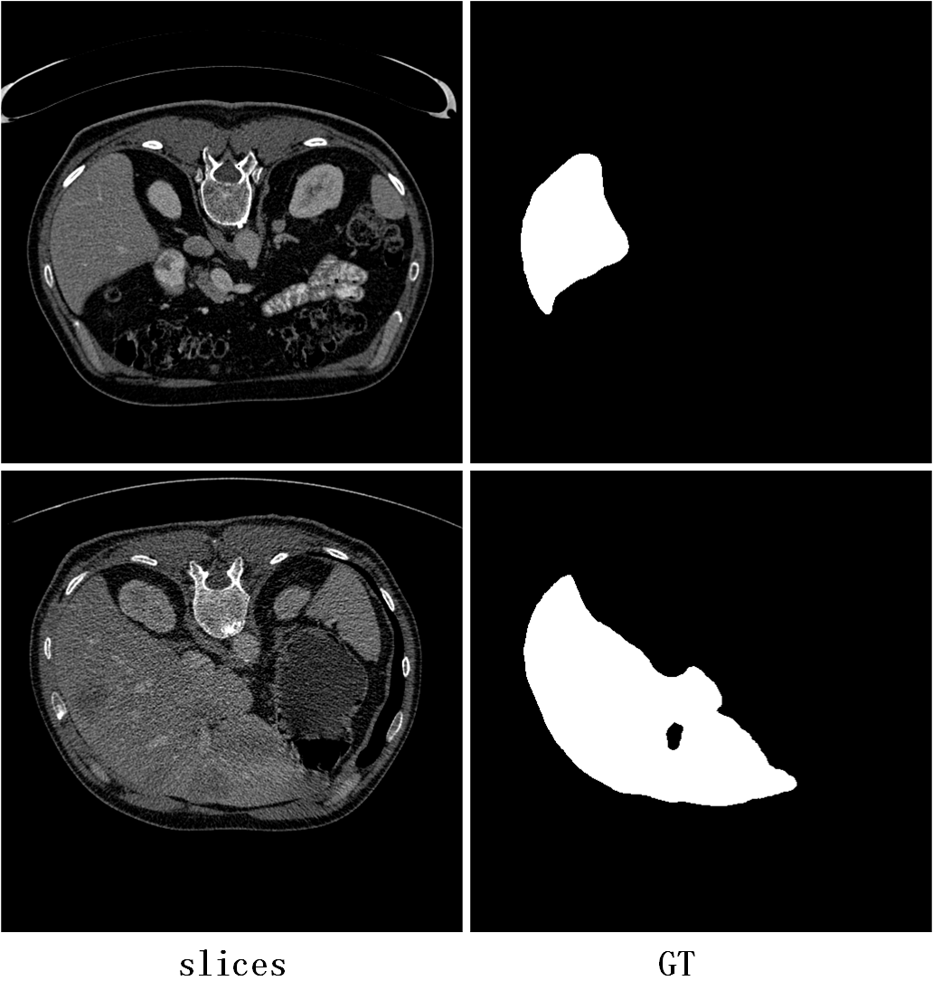
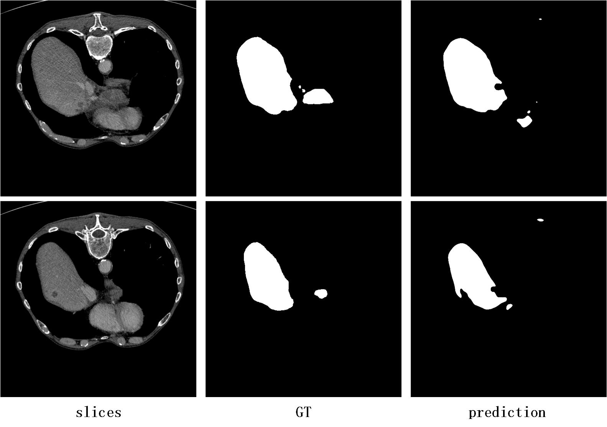

# Liver segmentation
> This project mainly introduces the liver CT segmentation.

## Dependencies
+ pytorch (1.4.0)
+ python (3.7.0+)
+ cuda-toolkit(10.0+)
+ torchvision (0.2.0+)
+ tensorboard (1.6.0)

## UNET-like-model
The proposed segmentation network is a `unet-like` cnn model. Seeing `models/model_seg.py` for specific network architecture.The loss function used in the project is  `nn.BCEWithLogitsLoss` based on `pytorch`.

## Results
In `liver_ct_data` directory, I provide you `train` and `test` samples:
  
  

